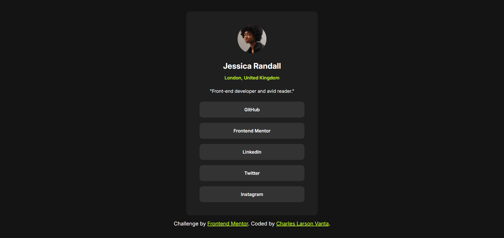

# Frontend Mentor - Social links profile solution

This is a solution to the [QR code component challenge on Frontend Mentor](https://www.frontendmentor.io/challenges/social-links-profile-UG32l9m6dQ). Frontend Mentor challenges help you improve your coding skills by building realistic projects. 

## Table of contents

- [Overview](#overview)
  - [Screenshot](#screenshot)
  - [Links](#links)
- [My process](#my-process)
  - [Built with](#built-with)
  - [What I learned](#what-i-learned)
  - [Continued development](#continued-development)
  - [Useful resources](#useful-resources)
- [Author](#author)
- [Acknowledgments](#acknowledgments)

## Overview

### Screenshot

### Links

- Live Site URL: [Here](https://lrsnvanta.github.io/frontend-mentor-projects/social-links-profile/)

## My process

### Built with

- Semantic HTML5 markup
- CSS custom properties
- Flexbox
- Grid

### What I learned

I used Figma as reference to accurately translate the design into code. It will make your life easier and stops your guessing how much paddings, margins etc. needed to match the design challenge.

Also, I learned about semantic HTML. It's important to know about if your tags are semantically correct rather than just using divs.

### Continued development

- Figma
- CSS Layouts
- Flexbox
- Grid
- Semantic HTML

### Useful resources

- [Semantic HTML](https://developer.mozilla.org/en-US/docs/Glossary/Semantics#semantics_in_html) - You can learn Semantic HTML here.

- [Box Model](https://developer.mozilla.org/en-US/docs/Learn_web_development/Core/Styling_basics/Box_model) - You can learn about the box model of the web page.

- [Flexbox](https://developer.mozilla.org/en-US/docs/Learn_web_development/Core/CSS_layout/Flexbox) - You can learn about Flexbox here.

- [Grid](https://developer.mozilla.org/en-US/docs/Learn_web_development/Core/CSS_layout/Grids) - You can learn about Grid layout here.

- [Units](https://developer.mozilla.org/en-US/docs/Learn_web_development/Core/Styling_basics/Values_and_units) - Values & Units

## Author

- Frontend Mentor - [@lrsnvanta](https://www.frontendmentor.io/profile/lrsnvanta)

## Acknowledgments

Google everything if you have any questions in your mind. ChatGPT or Grok or any other LLMs are useful too.
